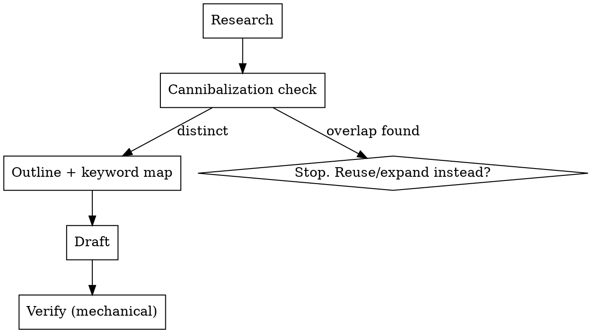

# Writing SEO blog posts for pixelboost.ca

## Overview

Producing an SEO blog post is a **research-then-write-then-verify workflow**, not just prose. Skipping research means guessing at demand; skipping verification means shipping fabricated stats, wrong-length meta, and broken internal links. The post must rank on Google/Bing **and** be quotable by AI engines (AEO — Answer Engine Optimization), because small-business owners increasingly ask ChatGPT/Perplexity instead of searching.

**Core principle:** Every SEO claim is verifiable. If you can't cite a source for a stat or count the characters in a title, don't assert it.

## When to use

- Writing any new post in `src/content/blog/`
- "Write a blog post about X", "create SEO content", "help us rank for X"
- Targeting Google/Bing **or** AI search citation (AEO/GEO)
- Editing an existing post for SEO

**Not for:** service-page copy, landing sections (those inline copy in components), or non-pixelboost sites (brand rules here are pixelboost-specific).

## The workflow — do not skip steps



### 1. Research (never invent demand or stats)

- **Primary keyword:** pick ONE head query the post answers. Confirm it's how a non-technical owner phrases it ("how much does a website cost" not "website pricing models").
- **People Also Ask / long-tail:** use `WebSearch` to find the real PAA questions and related searches for the primary keyword. These become your H2s and FAQ — do **not** invent FAQ questions from intuition (baseline failure).
- **Every statistic needs a source.** If you cite "53% of mobile users leave after 3s," you must have a real source (Google/Think with Google, HTTP Archive, etc.) confirmed via `WebSearch`. Fabricated stats destroy E-E-A-T and AI-citation trust. No source → cut the number or hedge ("more than half").

### 2. Cannibalization check (run, don't assume)

Existing posts compete with each other if they target the same query. **Run the check:**
```
Grep pattern "title:|description:" glob "src/content/blog/*.md" output_mode content
```
If an existing post already targets your query, **expand that post or pick a distinct angle** — don't publish a near-duplicate. Cross-link related posts instead (link equity + keeps users on-site).

### 3. Outline + keyword map

- Map primary keyword → title + H1-equivalent + first 100 words + meta description.
- Map secondary keywords → individual H2s. One intent per H2.
- Plan the **direct answer** that opens the post (see AEO below).
- List internal links: `Glob "src/content/blog/*.md"` and `src/content/services/*.md` to find every genuinely relevant post/service to link.

### 4. Draft — see `pixelboost-style.md` for voice + frontmatter rules

Write in pixelboost voice (plain-spoken, "you", lead with business cost). Structure for AEO (below).

### 5. Verify — mechanical, do it before claiming done

**REQUIRED SUB-SKILL:** Use superpowers:verification-before-completion. Run these and report actual output:
- Title 50–60 chars, description 150–160 chars. Count them (e.g. PowerShell `"...".Length`), don't eyeball.
- `npm run build` succeeds (frontmatter schema-valid; CSP-safe). Building requires the post on disk — saving the `.md` to verify is expected and fine. Set `draft: true` if it shouldn't go live yet, and tell the user the file was saved (and how to drop it).
- Every internal link path exists. Every external link resolves. Every stat has a cited source.

## On-page SEO (Google/Bing) — quick reference

| Element | Rule |
|---|---|
| `title` frontmatter | Primary keyword near front, sentence case, 50–60 chars |
| `description` frontmatter | Primary keyword once, compelling, 150–160 chars (it's the `<meta description>`) |
| First 100 words | Primary keyword appears naturally; state what the post delivers |
| Headings | **Start body at `## H2`** — the page renders the frontmatter title AS the on-page `<h1>` (see `[slug].astro`). A `# H1` in the markdown = duplicate H1. The template's `# H1` is wrong for this site. |
| H2/H3 | Each maps to a search sub-intent / PAA question. Secondary keywords live here. |
| Keyword density | Natural. No stuffing. Synonyms and related terms > repetition. |
| Internal links | 2–4 to relevant posts/services, descriptive anchor text |
| External links | 1–2 to high-authority sources (Google, gov, standards bodies) |
| Images | If used, descriptive alt text + compressed; `heroImage` is optional frontmatter |
| Local signal | Mention Toronto / Durham Region / Ontario once where natural (not stuffed) |

## AEO — getting cited by AI search (ChatGPT, Perplexity, AI Overviews)

AI engines lift **self-contained, quotable chunks**. Build them in:

1. **Direct answer in the first ~40 words.** Open with a complete, standalone answer to the title question. This is the single highest-leverage move for both featured snippets and AI citation.
2. **Scannable, liftable blocks:** a tight threshold list, a comparison table, a one-sentence rule in a blockquote. LLMs parse these cleanly.
3. **FAQ section** of real PAA questions (from research, step 1). Answer each in ~40–50 words, leading with "Yes"/"No"/a one-sentence summary.
4. **Specificity = citability.** Named metrics, concrete numbers (with real sources), dates. Vague copy doesn't get quoted.

### FAQ structured data is NOT automatic

This site emits only `LocalBusiness` JSON-LD (in `BaseLayout.astro`). There is **no `FAQPage` or `BlogPosting` schema** generated per post. Writing an FAQ in markdown does **not** create FAQ rich results. If structured data is wanted, it must be added explicitly — see `structured-data.md`. Don't claim a post will get FAQ rich snippets when the schema isn't emitted.

## Common mistakes (from baseline testing)

| Mistake | Fix |
|---|---|
| Writing/saving the file before research | Research → cannibalization check → outline → draft. Save only when asked. |
| Inventing FAQ questions | Pull real PAA questions via WebSearch. |
| Stating stats as fact without a source | Every number needs a cited, verified source, or cut it. |
| "Description is ~152 chars" (eyeballed) | Count characters. Report the actual number. |
| Assuming FAQ markdown → rich snippet | This site emits no FAQPage schema. See `structured-data.md`. |
| `# H1` at top of markdown | Start at `## H2`; title frontmatter is the H1. |
| Guessing one internal link | Enumerate posts/services, link all genuinely relevant ones. |
| Skipping the build | `npm run build` must pass (schema + CSP). |

## Red flags — STOP

- About to write prose before doing keyword research → stop, research first.
- About to type a percentage or statistic → do you have a source? If no, cut it.
- About to say "this gets a featured snippet / FAQ rich result" → did you verify schema is emitted? It usually isn't.
- About to claim title/description length → did you count? If no, count.
- About to save a file you weren't asked to save → don't.
